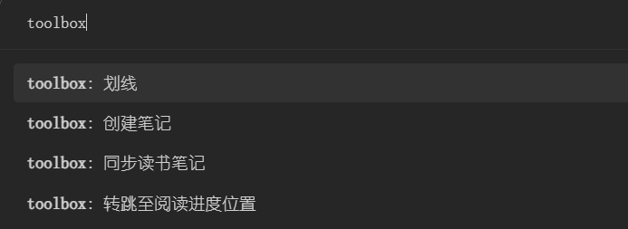
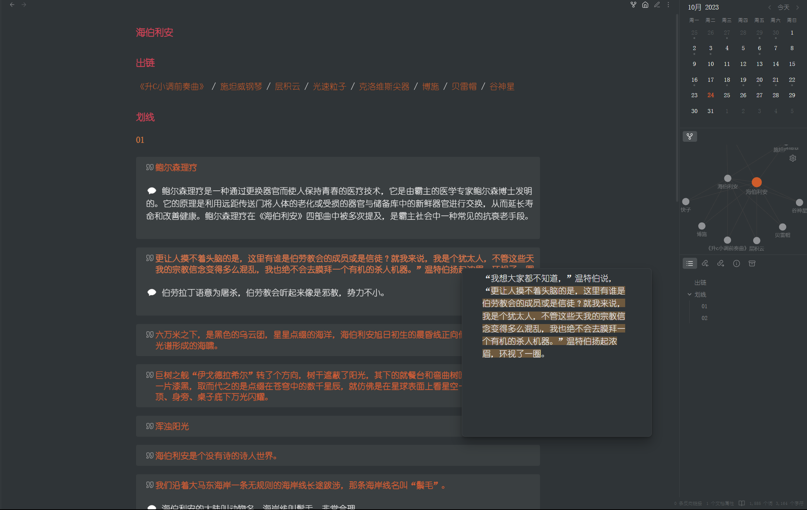

# obsidian-toolbox

墨水屏阅读器插件以及一些平时用得到的小功能。解决使用微信阅读和obsidian（读和写）的割裂感，溯源困难以及双链。toolbox 让阅读与作笔记无缝衔接，体验丝滑，属于 `ALL IN ONE` 思想。

- [x] 跟踪阅读时长
- [x] 跟踪阅读进度
- [x] 跟踪阅读状态
- [x] 转跳至阅读进度位置
- [x] 翻页
- [x] 划线，写想法，创建卡片笔记
- [x] 读书笔记同步
- [x] 元数据同步
- [x] 每日一句
- [x] 多义笔记转跳

注意，您需要把 pdf，epub，mobi，word 等可读格式，转换为 markdown。对，就是使用原生的阅读方式，因此，它支持移动端和墨水屏阅读器以及双链，dataview 等插件（进行定制化需求）

日后，看情况可能会把大杂烩分成一个个小插件，有新的功能也会及时更新。

# 使用指南

obsidian-toolbox 跟踪指定文件夹（不支持嵌套） book 标签的笔记，跟踪数据直接写入到 yaml 中。

```js
---
tags: book
bookReview: 一条书评           // 书评（同步读书笔记时会被使用）
readingDate: 2023-10-15 16:59  // 开始阅读的日期
completionDate: 2023-10-21  // 结束阅读的日期
readingTime: 59544888   // 阅读时长
readingTimeFormat: 16h32m24s // 阅读时长的格式化
readingProgress: 86.23    // 阅读进度（保留两位小数）
outlinks: 1              // 出链数量
highlights: 7           // 划线数量
thinks: 1               // 想法数量
---
```

为什么要写入到 yaml 中？方便使用 davedate 插件做数据统计。

```
---
title: 猎魔人
tags: book
cover: 猎魔人全集.jpg
author: 安杰伊·萨普科夫斯基
bookReview: 
top: false
relationshipDiagram: true
readingDate: 2023-10-21
completionDate: 
readingTime: 16633896
readingProgress: 31.16
highlights: 4
thinks: 2
outlinks: 0
readingTimeFormat: 4h37m13s
---
```

```dataview
table without id
	embed(link(cover)) as "封面" ,
	choice(top, "🔥", "") + choice(completionDate, "🏆", "") + "《[" + file.name + "](" + file.path + ")》" + author,
	 "[笔记](书库/读书笔记/" + file.name +")" + choice(relationshipDiagram, " / [人物关系](书库/人物关系/" + title +")", ""),
	choice(completionDate, "进度 100% <br>", choice(readingDate,choice(readingProgress, "进度 " + readingProgress + "% <br> ", ""), "进度 未读<br>")) + choice(readingTimeFormat, "时长 "+ durationformat(dur(readingTimeFormat), "h'h'm'm's's'")+"<br>", "") + "划线 " + highlights + " <br>想法 "  + thinks + " <br>出链 " + outlinks,
	bookReview
from "书库" and #book
sort top DESC, file.mtime DESC
```


# 指令



- **划线**：使用`====` 高亮，为划线写的想法放至 `%%%%` 中，在预览模式下不显示想法，只显示划线高亮（非侵入式）。
    - 在行尾生成一个块id并记录，这也是为什么书和阅读笔记里形成双链的原因。
- **创建笔记**：选中的文字形成一个 `[[选中的文字|选中的文字]]` 的链接，并且在指定文件夹里创建一个笔记，方便做独立笔记（比如卢曼卡片笔记）
- **同步读书笔记**：同步所有笔记的划线，评论，出链。
    - 在设置里，开启块id（默认是开启的），会在每一条笔记后面生成一个块id（由md5算法），划线内容不变，id不变，意味着你可以在其他地方引用读书笔记。
- **转跳至阅读位置**： 由于 obsidian 底层的性能问题，对于大体积单文件首次打开必须要等待一段时间。会导致转跳至阅读位置，转跳不准确，解决方法是多点几次。
    - 单文件建议不超过2m（满足 99% 图书的大小，合集的拆分开）

[obsidian 中文论坛中关于 obsidian-toolbox 的一些讨论](https://forum-zh.obsidian.md/t/topic/24904)


# 定制化 obsidian 的一些截图

主页


书库


读书笔记

