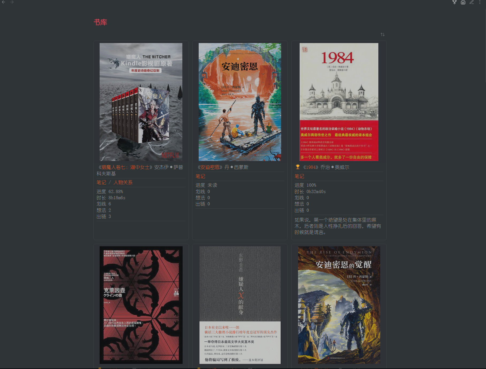

# Obsidian-toolbox

墨水屏阅读器插件以及一些平时用得到的小功能。解决使用微信阅读和obsidian（读和写）的割裂感，溯源困难以及双链。toolbox 让阅读与作笔记无缝衔接，体验丝滑，属于 `ALL IN ONE` 思想。

- [x] 跟踪阅读时长
- [x] 跟踪阅读进度
- [x] 转跳至阅读进度位置
- [x] 翻页
- [x] 划线，写想法，创建卡片笔记
- [x] 读书笔记同步
- [x] 元数据同步
- [x] 每日一句
- [x] 多义笔记转跳

日后，看情况可能会把大杂烩分成一个个小插件，有新的功能也会及时更新。

# 定制化 obsidian 的一些截图

主页

书库

读书笔记

